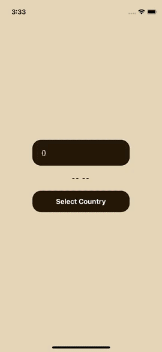

# react-native-country-code-select

[](https://www.npmjs.org/package/react-native-country-code-select)  [](https://www.android.com)  [](https://developer.apple.com/ios)  [](https://opensource.org/licenses/MIT)


---

This is pure javascript library for selecting the country with search and filter using quick select and search via country name

## 🎬 Preview
---
  <table>
    <tr>
      <td><a href="https://github.com/SimformSolutionsPvtLtd/react-native-country-code-select"></a></td>
      <td><a href="https://github.com/SimformSolutionsPvtLtd/react-native-country-code-select"></a>
     </td>
      <td><a href="https://github.com/SimformSolutionsPvtLtd/react-native-country-code-select"></a>
     </td>
    </tr>
  </table>

---
## Quick Access
[Installation](#installation) | [CountryPicker](#countrypicker) | [Methods](#methods) | [Properties](#props) | [Example](#example) | [License](#license)

## Installation
```bash
$ npm install react-native-country-code-select
# --- or ---
$ yarn add react-native-country-code-select
```
## Install additional dependency
```bash
$ npm install react-native-gesture-handler react-native-reanimated
# --- or ---
$ yarn add react-native-gesture-handler react-native-reanimated
```
##### Know more about [react-native-gesture-handler](https://www.npmjs.com/package/react-native-gesture-handler), [react-native-reanimated](https://www.npmjs.com/package/react-native-reanimated) 
--- 
## CountryPicker
#### 🎬 Preview
---


#### Usage
---
```jsx
import React, { useState } from 'react';
import { StyleSheet, Text, View, TouchableOpacity } from 'react-native';
import { CountryPickerModal } from 'react-native-country-code-select';
import { GestureHandlerRootView } from 'react-native-gesture-handler';

const App = () => {
  const [isVisible, setIsVisible] = useState(false);
  const [selectedValue, setSelectedValue] = useState({});
  return (
    <GestureHandlerRootView style={styles.container}>
      <View style={styles.viewStyle}>
        <Text style={styles.textView}>
          {JSON.stringify(selectedValue, null, 2)}
        </Text>
        <Text style={styles.separator}>{'-- --'}</Text>
        <TouchableOpacity 
          activeOpacity={0.8} 
          style={styles.selectCountryButton}
          onPress={() => setIsVisible(oldStatus => !oldStatus)}
        >
          <Text style={styles.selectCountry}>Select Country</Text>
        </TouchableOpacity>
        <CountryPickerModal
          isVisible={isVisible}
          onClose={() => setIsVisible(false)}
          {...{onSelect: setSelectedValue}}
        />
      </View>
    </GestureHandlerRootView>
  );
};

export default App;

const styles = StyleSheet.create({
  container: {
    flex: 1, 
    backgroundColor: '#e6d7b8'
  },
  textView: {
    width: '60%', 
    backgroundColor: '#261a08', 
    padding: 20, 
    borderWidth: 1, 
    borderRadius: 20, 
    overflow: 'hidden', 
    color: '#ffffff', 
    fontWeight: '500'
  },
  viewStyle: {
    justifyContent: 'center',
    alignItems: 'center',
    flex: 1,
  },
  selectCountryButton: {
    width: '60%',
    alignItems: 'center',
    justifyContent: 'center',
    paddingVertical: 15,
    backgroundColor: '#261a08',
    borderRadius: 20,
  },
  selectCountry: {
    color: '#ffffff',
    fontWeight: 'bold',
    fontSize: 16
  },
  separator: {
    marginVertical: 20,
    letterSpacing: 2,
    fontSize: 15,
    fontWeight: 'bold'
  }
});
```
---
## Selected Country Data
```javascript
{
  name: string;
  flag: string;
  countryInitials: string;
  region: string;
  subregion: string;
  callingCode: string[];
  currency: string[];
}
```
## Methods

> |Name|Description
>|:-|:-
>|**onClose***|callback for closing the modal
>|**onSelect***|callback for selecting country will reture current selected city

## Props

> |Name|Default Value|Description
>|:-|:-:|:-
>|***isVisible****|false|to visible the modal itself
>|customBackImage|false|to set user specific back image
>|customBackImageStyle|false|to set user specific back image style
>|isFlagVisible|false|to visible the flags in the list
>|isAlphabetsVisible|false|to visible alphabets for quick access the country
>|headerSearchPlaceholder|"Enter Country"|to set default placeholder for header search input
>|isSearchInputVisible|true|to enabled/disabled the header search input
>|renderCustomSearchInput|undefined|to render user specific component
>|searchHeaderStyle|{}|to give a style in header search input
>|isCloseButtonVisible|false|to enabled/disabled the close button for modal
>|searchHeaderProps|{}|to pass extra props into the header search input
>|countryListTitleStyle|{}|to specifies user specific styles
>|customModalStyles|{}|style for a modal container
>|customTopHeaderStyle| {} | style for upper sheet area
>|customRowStyle|{}|style for country list item 
>|customAlphabetsStyles|{}|style for alphabets list 
>|customAlphabetContainerStyles|{} |style for alphabet container style
>|emptyText|"" |text shown when there is no data if search country is not available
>|emptyTextStyle|{}|style for empty text
>|emptyContainerStyles| {}  |style for container of empty text
>|renderCustomEmptyComponent|undefined|to render user specific empty component
>|customCloseButton|undefined|to render user specific button
>|renderSearchInputClear|undefined|render custom clear header search input

---
## Example
A full working example project is here [Example](./example/src/App.tsx)
```sh
$ yarn
$ yarn example ios   // For ios
$ yarn example android   // For Android
```
## Find this library useful? ❤️
Support it by joining [stargazers](https://github.com/SimformSolutionsPvtLtd/react-native-country-code-select/stargazers) for this repository.⭐

## Bugs / Feature requests / Feedbacks 
For bugs, feature requests, and discussion please use [GitHub Issues](https://github.com/SimformSolutionsPvtLtd/react-native-country-code-select/issues/new?labels=bug&late=BUG_REPORT.md&title=%5BBUG%5D%3A), [GitHub New Feature](https://github.com/SimformSolutionsPvtLtd/react-native-country-code-select/issues/new?labels=enhancement&late=FEATURE_REQUEST.md&title=%5BFEATURE%5D%3A), [GitHub Feedback](https://github.com/SimformSolutionsPvtLtd/react-native-country-code-select/issues/new?labels=enhancement&late=FEATURE_REQUEST.md&title=%5BFEEDBACK%5D%3A)

## 🤝 How to Contribute
We'd love to have you improve this library or fix a problem 💪
Check out our [Contributing Guide](CONTRIBUTING.md) for ideas on contributing.
## License
- [MIT License](LICENSE)